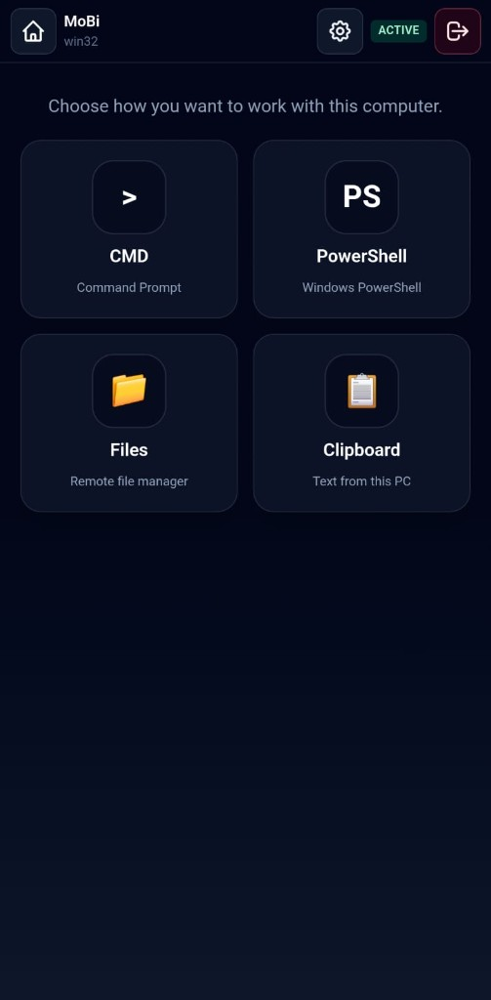
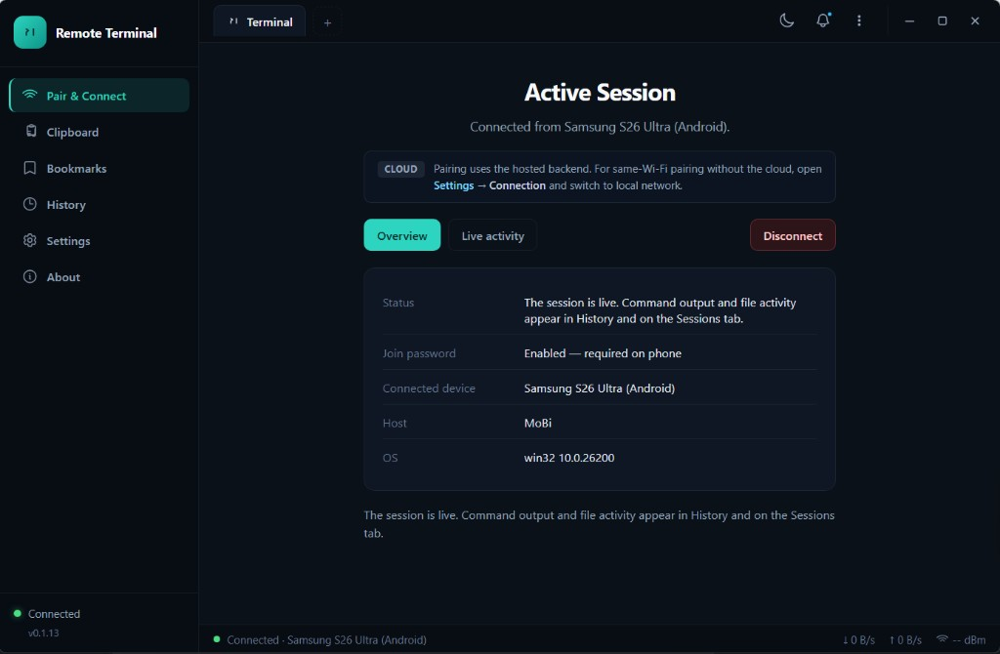
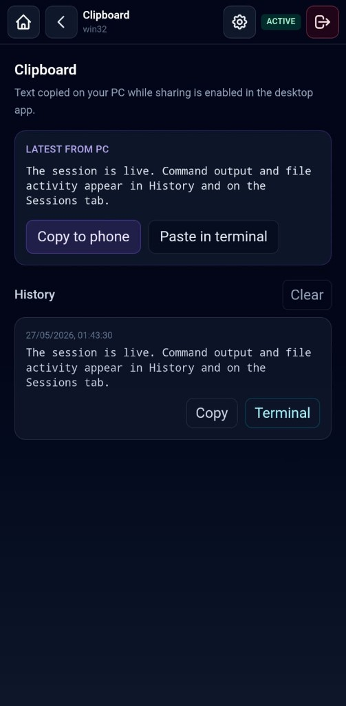
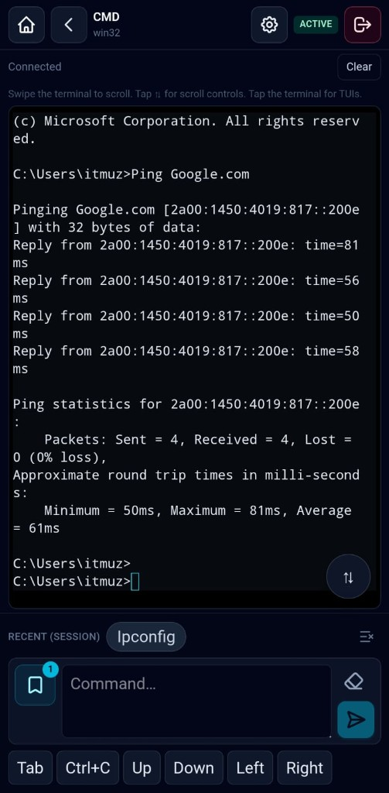

<p align="center">
  
</p>

<h1 align="center">Remote Terminal</h1>

<p align="center">
  <strong>Your PC terminal in your pocket.</strong><br />
  Pair with a QR code, run PowerShell or CMD, browse files, sync clipboard text, and stay connected — securely.
</p>

<p align="center">
  <a href="#-downloads">Downloads</a> •
  <a href="#-first-time-setup">First-time setup</a> •
  <a href="#-quick-start">Quick Start</a> •
  <a href="#-features">Features</a> •
  <a href="#-screenshots">Screenshots</a> •
  <a href="#-how-it-works">How it works</a> •
  <a href="#-faq">FAQ</a>
</p>

<p align="center">
  
</p>

---

## 🎯 Purpose

**Remote Terminal** lets you control a real shell on your Windows or Mac computer from your **Android or iOS** phone.

Use it when you are away from your desk but still need to:

- Run **PowerShell** or **CMD** on a Windows PC (pick either from the session hub)
- Use **bash/zsh** on macOS
- **Upload and download files** without SFTP
- **Sync clipboard text** between phone and PC (each side opt-in)
- Keep a **persistent session** when you switch apps on your phone

The desktop app runs in the **system tray**, shows a **QR code** for pairing, and relays terminal I/O through a secure backend. The mobile app is optimized for touch, small screens, scroll controls, and intermittent networks.

> **Note:** This repository is the **public distribution & documentation** hub. Application source code is maintained separately.

---

## 📥 Downloads

### Windows 10/11 (x64)

| Format | Download | Notes |
|--------|----------|--------|
| **Portable** (zip) | [Remote-Terminal-0.1.13-Windows-x64.zip](https://github.com/w3sourcecode/remote-terminal-app/releases/latest/download/Remote-Terminal-0.1.13-Windows-x64.zip) | Unzip and run `Remote Terminal.exe` — no installer |
| **Setup** (NSIS) | [Remote-Terminal-0.1.13-Windows-x64-Setup.exe](https://github.com/w3sourcecode/remote-terminal-app/releases/latest/download/Remote-Terminal-0.1.13-Windows-x64-Setup.exe) | Guided installer; choose install folder |
| **WinNT setup** | [Remote-Terminal-0.1.13-WinNT-x64.exe](https://github.com/w3sourcecode/remote-terminal-app/releases/latest/download/Remote-Terminal-0.1.13-WinNT-x64.exe) | Same installer flow; labeled for workstation / WinNT deployments |

### macOS 11+

| Mac | Download | Notes |
|-----|----------|--------|
| **Apple Silicon** (M1/M2/M3/M4) | [Remote-Terminal-0.1.13-macOS-arm64.dmg](https://github.com/w3sourcecode/remote-terminal-app/releases/latest/download/Remote-Terminal-0.1.13-macOS-arm64.dmg) | Open DMG → drag to Applications |
| **Intel** | [Remote-Terminal-0.1.13-macOS-x64.dmg](https://github.com/w3sourcecode/remote-terminal-app/releases/latest/download/Remote-Terminal-0.1.13-macOS-x64.dmg) | For Intel Macs |

First launch on unsigned Mac builds: right-click **Remote Terminal** → **Open**, or allow in **System Settings → Privacy & Security**.

### Mobile

| Platform | Download | Notes |
|----------|----------|--------|
| **Android** | [Google Play](https://play.google.com/store/apps/details?id=com.billten.remoteterminal) | Requires the desktop agent on your PC |
| **iOS** | TestFlight / App Store (coming soon) | Requires macOS + Apple developer setup to build locally |

See **[Releases](https://github.com/w3sourcecode/remote-terminal-app/releases)** for all published packages and release notes.

---

## 🆕 First-time setup

Use this order the first time you install Remote Terminal.

### Step 1 — Desktop agent (your PC)

1. **Download** a [Windows package](#-downloads) (portable zip or setup exe) or a **macOS DMG** (Apple Silicon or Intel).
2. **Windows:** run the **setup exe** or unzip the portable zip and run **`Remote Terminal.exe`**. **Mac:** open the DMG and drag **Remote Terminal** to Applications.
3. On first launch, set a **join password** when prompted (recommended — required for Session ID pairing).
4. The app stays in the **system tray**. Open the dashboard → **Pair & Connect**:
   - **QR code** on the left (scan from your phone)
   - **Session ID** on the right, formatted like `123 456 789`
   - **Local network URL** when using same-Wi-Fi mode (phone → Server in mobile settings)

Keep the desktop agent running while you use the phone.

### Step 2 — Mobile app (your phone)

1. Install **[Remote Terminal on Google Play](https://play.google.com/store/apps/details?id=com.billten.remoteterminal)** (Android) or your iOS build when available.
2. On first open, the app shows a **setup tour** — follow it to download the desktop agent and learn how to pair.
3. Tap **Scan QR** and point the camera at the PC screen (fastest), **or** tap **Session ID**, enter the nine digits, then the **join password** from desktop Settings.
4. After pairing, open **CMD**, **PowerShell**, **Files**, or **Clipboard** from the session hub.

Tap **Setup** on the mobile home screen anytime to replay the tour.

### Step 3 — Stay connected

- The phone **restores your session** when you reopen the app (saved sessions on Home).
- The desktop agent keeps running in the tray until you quit.
- On Android home, press **back twice** to exit the app.
- After PC sleep/hibernate, use **Reconnect now** on the desktop dashboard if the agent shows offline.

---

## ⚡ Quick Start

### 1. Desktop (host PC)

1. Download a **Windows** portable zip or setup exe (or install the **macOS** app from a DMG).
2. Run **Remote Terminal** — on first launch, set a **join password** (recommended for pairing).
3. The tray icon appears; open the **dashboard** → **Pair & Connect** to see the **QR code** and formatted **session ID** side by side.

**Connection mode** (Settings → Connection):

| Mode | Best for |
|------|----------|
| **Cloud** | Phone and PC anywhere with internet; uses the hosted HTTPS backend |
| **Local network** | Same Wi-Fi — pairing on your LAN without cloud; mobile app uses the PC’s LAN URL |

### 2. Mobile (phone)

1. Install the app from [Google Play](https://play.google.com/store/apps/details?id=com.billten.remoteterminal) (Android).
2. Scan the QR (encodes server + session) **or** enter session ID + join password.
3. Open the **session hub** — choose **CMD**, **PowerShell**, **Files**, or **Clipboard**.

<p align="center">
  
  &nbsp;&nbsp;
  
  &nbsp;&nbsp;
  
</p>

### 3. Stay connected

- The mobile app **restores your session** when reopened.
- The desktop agent keeps running in the tray until you quit.
- Use **double back** on Android home to exit the app.

---

## ✨ Features

| Feature | Description |
|---------|-------------|
| 🖥️ **Remote shell** | Real PTY on the desktop — **CMD** and **PowerShell** on Windows; bash/zsh on macOS |
| 📱 **QR pairing** | Scan from the phone; optional pairing token when join password is set |
| 🏠 **Local network mode** | Pair on the same Wi-Fi using the PC’s LAN URL — no cloud required |
| ☁️ **Cloud mode** | Hosted backend for pairing when phone and PC are not on the same network |
| 🔐 **Join password** | Protects session ID pairing; asked once per PC until you tap **Leave** on mobile |
| 🔒 **Optional quit password** | Extra protection when closing the agent from the tray |
| 📁 **Remote files** | Browse drives and folders; upload, download, and delete on the connected PC |
| 📋 **Clipboard sync** | Phone → PC and PC → phone (each side opt-in in session settings / desktop settings) |
| 🔄 **Session restore** | Mobile reconnects from Home; desktop survives app backgrounding |
| 📊 **Activity log** | Desktop records connects, commands, and file operations locally |
| 🪟 **Windows & macOS agent** | Tray app with dashboard, bookmarks, clipboard history, settings |
| 🤖 **Android & iOS client** | Terminal UI, files, clipboard screen, session settings |
| 📜 **Terminal UX** | Per-shell history on Windows, on-demand scroll controls, shortcut keys (Tab, Ctrl+C, arrows) |
| ⚡ **HTTP file channel** | Large transfers use a dedicated HTTP path alongside SignalR |
| 🛡️ **HTTPS backend** | Session tokens and hub traffic over TLS in production |

---

## 📸 Screenshots

### Desktop agent

<p align="center">
  
</p>

<p align="center">
  
</p>

| Area | What you see |
|------|----------------|
| **Pair & Connect** | QR code, 9-digit session ID, cloud vs local network banner |
| **Active session** | Connected phone, host/OS, join password status, disconnect |
| **Clipboard** | History of text received from the phone; toggle **Share PC clipboard with phone** |
| **Activity** | Local log of commands, file ops, and connections |

### Mobile app

<p align="center">
  
  &nbsp;&nbsp;
  
  &nbsp;&nbsp;
  
</p>

<p align="center">
  
  &nbsp;&nbsp;
  
  &nbsp;&nbsp;
  
</p>

---

## 🏗️ How it works

```text
┌─────────────┐     QR / Session ID      ┌─────────────┐
│   Mobile    │ ◄──────────────────────► │   Backend   │
│             │   SignalR + JWT + HTTP   │             │
└──────┬──────┘                          └──────┬──────┘
       │                                          │
       │    terminal / files / clipboard          │
       └──────────────────┬───────────────────────┘
                          │
                   ┌──────▼──────┐
                   │   Desktop   │
                   │    agent    │
                   └─────────────┘
```

1. The **desktop agent** registers a session and displays a QR code (and pairing token when a join password is set).
2. The **mobile app** scans the QR (or enters session ID + join password).
3. The **API** issues a session token; both sides connect to **SignalR** hubs (terminal, files, clipboard).
4. Terminal keystrokes and output are relayed to a local **PTY** on the PC.
5. File bytes use **HTTP** endpoints for throughput; control messages stay on the hub.

---

## 📖 Detailed usage

### Desktop agent

| Action | How |
|--------|-----|
| Open dashboard | Tray icon → **Show QR** / menu **Open dashboard** |
| Settings | Tray → **Settings** — join password, quit password, connection mode (cloud / local), auto-start |
| Reconnect after sleep | Dashboard → **Reconnect now** if status shows offline |
| Disconnect phones | Dashboard or tray → disconnect session |
| View activity | Dashboard → **Activity** (local history) |
| Clipboard | Dashboard → **Clipboard** — phone → PC history; enable PC → phone sharing in settings |

### Mobile app

| Screen | What you can do |
|--------|-----------------|
| **Home** | Scan QR, enter session ID, open saved sessions (online / closed) |
| **Session hub** | **CMD**, **PowerShell**, **Files**, **Clipboard**; gear opens session settings |
| **Terminal** | Run commands; recent commands; scroll controls; Tab / Ctrl+C / arrow keys |
| **Files** | Browse remote folders; upload & download to device Downloads |
| **Clipboard** | Latest from PC; **Copy to phone** or **Paste in terminal**; history |
| **Session settings** | Share/receive clipboard, auto-sync to phone, default Windows shell |

### Pairing without QR

1. On desktop, note the **9-digit session ID** (shown as `123 456 789`) on **Pair & Connect**.
2. On mobile: **Session ID** → enter ID → **join password** from desktop Settings.
3. Tap **Connect**.

---

## 📊 Comparison

| Capability | Remote Terminal | SSH + Termius |
|------------|-----------------|---------------|
| Real terminal (PTY) | ✅ | ✅ |
| Mobile-first UI | ✅ | ✅ |
| QR / simple pairing | ✅ | ❌ |
| Same-Wi-Fi local mode | ✅ | LAN only |
| Remote file browser | ✅ | SFTP only |
| Clipboard sync | ✅ | ❌ |
| Join password gate | ✅ | Keys/password |
| Lightweight tray agent | ✅ | N/A |
| No router port forward* | ✅ | ❌ |

\*Cloud mode uses an outbound connection to your API. Local network mode uses the PC’s LAN address on the same Wi-Fi.

---

## ❓ FAQ

**Is the source code public?**  
This repo is for **downloads and documentation**. Source is in a private development repository.

**Do I need to open firewall ports on my PC?**  
**Cloud mode:** the desktop agent connects **outbound** to your API — you do not expose your PC to the internet. **Local network mode:** the bundled API listens on your LAN (same Wi-Fi); allow it in Windows Firewall if prompted.

**Why is a join password recommended?**  
So random devices cannot attach to your session if they guess the session ID.

**Can I use PowerShell and cmd on Windows?**  
Yes — pick **CMD** or **PowerShell** from the session hub, or set a default in **Session settings**.

**How does clipboard sync work?**  
Enable **Share with desktop** on the phone and **Share PC clipboard with phone** on the desktop. PC → phone copies appear in the mobile **Clipboard** screen; use **Copy to phone** or **Paste in terminal**.

**Where is the Android app?**  
[Google Play — Remote Terminal](https://play.google.com/store/apps/details?id=com.billten.remoteterminal)

**Where is macOS download?**  
Use the **Apple Silicon** or **Intel DMG** links above. Builds are produced on GitHub Actions; see [releases/BUILD_MACOS.md](releases/BUILD_MACOS.md) if you need to rebuild.

---

## 📄 License

Documentation and release assets in this repository are provided for distribution of the **Remote Terminal** application.

Application licensing is defined by the publisher. Contact the maintainer for commercial or redistribution terms.

---

## ⭐ Support

If Remote Terminal helps your workflow, **star this repo** and share feedback via [GitHub Issues](https://github.com/w3sourcecode/remote-terminal-app/issues).

---

<p align="center">
  Built for developers who need their terminal within reach — desk, couch, or coffee shop.
</p>
