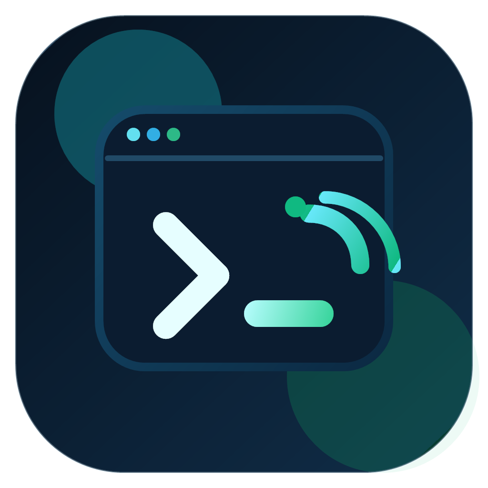
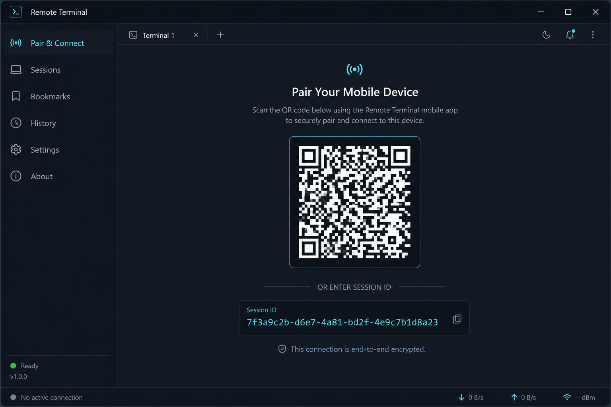
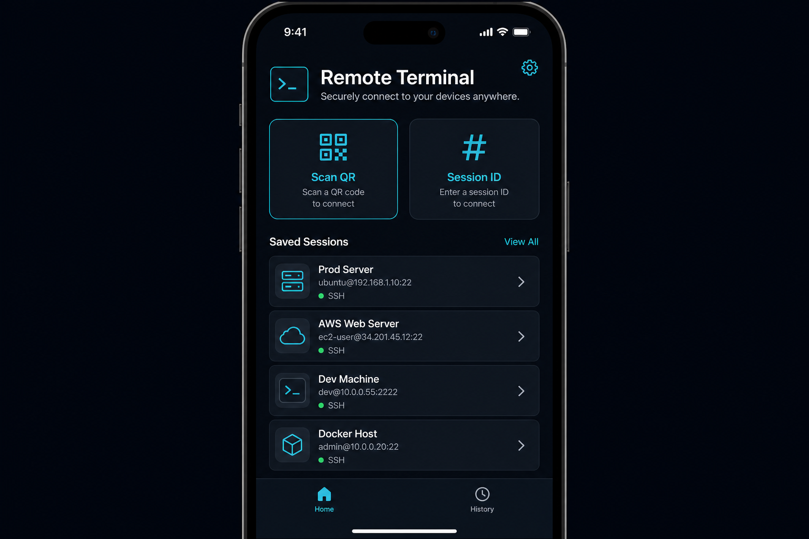
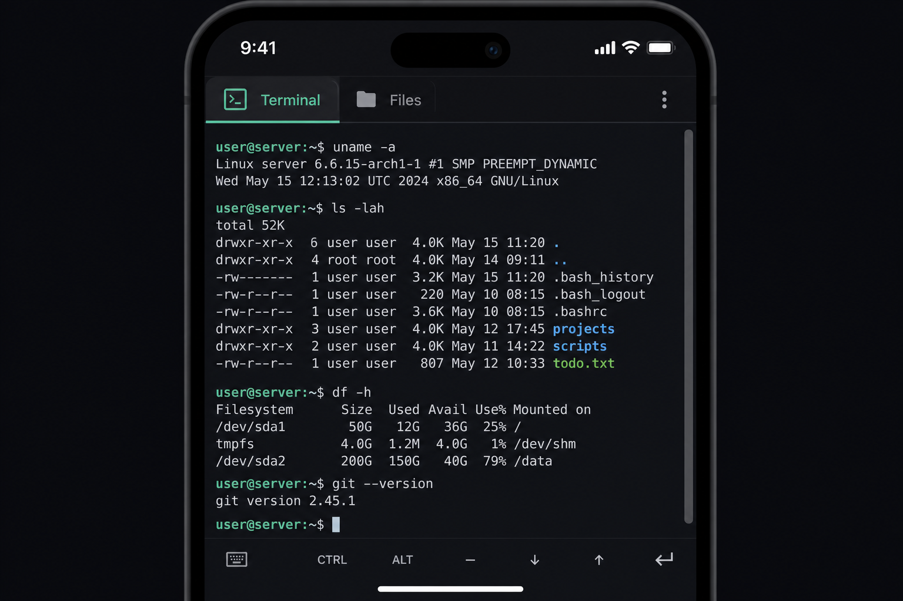
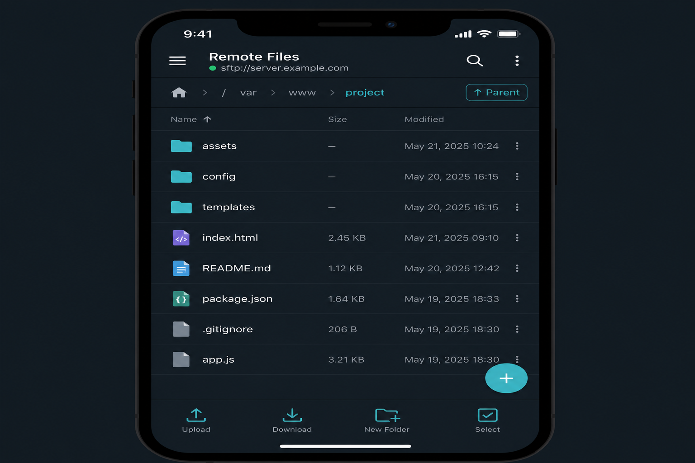

<p align="center">
  
</p>

<h1 align="center">Remote Terminal</h1>

<p align="center">
  <strong>Your PC terminal in your pocket.</strong><br />
  Pair with a QR code, run commands from your phone, browse files, and stay connected — securely.
</p>

<p align="center">
  <a href="#-downloads">Downloads</a> •
  <a href="#-quick-start">Quick Start</a> •
  <a href="#-features">Features</a> •
  <a href="#-how-it-works">How it works</a> •
  <a href="#-faq">FAQ</a>
</p>

<p align="center">
  
</p>

---

## 🎯 Purpose

**Remote Terminal** lets you control a real shell on your Windows or Mac computer from your **Android or iOS** phone.

Use it when you are away from your desk but still need to:

- Run **PowerShell** or **cmd** on a Windows PC
- Use **bash/zsh** on macOS
- **Upload and download files** without SFTP
- **Copy text** between phone and desktop
- Keep a **persistent session** when you switch apps on your phone

The desktop app runs in the **system tray**, shows a **QR code** for pairing, and relays terminal I/O through a secure backend. The mobile app is optimized for touch, small screens, and intermittent networks.

> **Note:** This repository is the **public distribution & documentation** hub. Application source code is maintained separately.

---

## 📥 Downloads

| Platform | Package | Notes |
|----------|---------|--------|
| **Windows 10/11** (x64) | [Remote-Terminal-0.1.8-Windows-x64.zip](https://github.com/w3sourcecode/remote-terminal-app/releases/latest/download/Remote-Terminal-0.1.8-Windows-x64.zip) | Portable folder — unzip and run `Remote Terminal.exe` |
| **macOS 11+** (Apple Silicon) | [Build on Mac](releases/BUILD_MACOS.md) | DMG/ZIP built with `npm run build:mac` on a Mac |
| **macOS 11+** (Intel) | [Build on Mac](releases/BUILD_MACOS.md) | Same build scripts, `x64` target |
| **Android** | APK via internal build / Play (coming soon) | Built from the mobile project with Capacitor |
| **iOS** | Xcode / TestFlight (coming soon) | Requires macOS + Apple developer setup |

See **[Releases](https://github.com/w3sourcecode/remote-terminal-app/releases)** for all published desktop packages.

---

## ⚡ Quick Start

### 1. Desktop (host PC)

1. Download and unzip the **Windows** package (or install the **macOS** app from a build on your Mac).
2. Run **Remote Terminal** — on first launch, set a **join password** (required for pairing).
3. The tray icon appears; open the **dashboard** to see the **QR code** and **session ID**.

### 2. Mobile (phone)

1. Install the Remote Terminal mobile app (Android/iOS build).
2. Point the app at your backend URL (or scan the QR — it encodes server + session).
3. Enter the **join password** when prompted (session ID path) or scan QR directly.
4. Open **Terminal**, **Files**, or **Clipboard** from the session hub.

<p align="center">
  
  &nbsp;&nbsp;
  
  &nbsp;&nbsp;
  
</p>

### 3. Stay connected

- The mobile app **restores your session** when reopened.
- The desktop agent keeps running in the tray until you quit.
- Use **double back** on Android home to exit the app.

---

## ✨ Features

| Feature | Description |
|---------|-------------|
| 🖥️ **Remote shell** | Real PTY on the desktop — PowerShell, cmd, bash, or zsh depending on OS |
| 📱 **QR pairing** | Scan from the phone; no manual IP or port forwarding on the LAN |
| 🔐 **Join password** | Required on the desktop; phones must enter it when pairing by session ID |
| 🔒 **Optional quit password** | Extra protection when closing the agent from the tray |
| 📁 **Remote files** | List folders, upload, download, and delete on the connected PC |
| 📋 **Clipboard sync** | Send text from the phone to the desktop session |
| 🔄 **Session restore** | Mobile reconnects and restores history after app restarts |
| 📊 **Activity log** | Desktop records connects, commands, and file operations locally |
| 🪟 **Windows & macOS agent** | Electron tray app with dashboard, settings, and QR window |
| 🤖 **Android & iOS client** | Capacitor app with terminal UI, files, and session hub |
| ⚡ **HTTP file channel** | Large transfers use a dedicated HTTP path alongside SignalR |
| 🛡️ **HTTPS backend** | Session tokens and hub traffic over TLS in production |

---

## 🏗️ How it works

```text
┌─────────────┐     QR / Session ID      ┌─────────────┐
│   Mobile    │ ◄──────────────────────► │   Backend   │
│  (Angular)  │      SignalR + JWT       │  (ASP.NET)  │
└──────┬──────┘                          └──────┬──────┘
       │                                          │
       │         commands / output / files        │
       └──────────────────┬───────────────────────┘
                          │
                   ┌──────▼──────┐
                   │   Desktop   │
                   │  (Electron) │
                   │  + node-pty │
                   └─────────────┘
```

1. The **desktop agent** registers a session and displays a QR code.
2. The **mobile app** scans the QR (or enters session ID + join password).
3. The **API** issues a session token; both sides connect to **SignalR**.
4. Terminal keystrokes and output are relayed to a local **PTY** on the PC.
5. File bytes use **HTTP** endpoints for throughput; control messages stay on the hub.

---

## 📖 Detailed usage

### Desktop agent

| Action | How |
|--------|-----|
| Open dashboard | Tray icon → **Show QR** / menu **Open dashboard** |
| Settings | Tray → **Settings** — join password, quit password, auto-start |
| Disconnect phones | Dashboard or tray → disconnect session |
| View activity | Dashboard → **Activity** tab (local SQLite history) |

### Mobile app

| Screen | What you can do |
|--------|-----------------|
| **Home** | Scan QR, enter session ID, open saved sessions |
| **Session hub** | Jump to Terminal, Files, or disconnect |
| **Terminal** | Run commands; history optimized for mobile |
| **Files** | Browse remote folders; upload & download |

### Pairing without QR

1. On desktop, note the **9-digit session ID** on the dashboard.
2. On mobile: **Session ID** → enter ID → **join password** from desktop Settings.
3. Tap **Connect**.

---

## 📊 Comparison

| Capability | Remote Terminal | SSH + Termius | TeamViewer | Chrome Remote Desktop |
|------------|-----------------|---------------|------------|------------------------|
| Real terminal (PTY) | ✅ | ✅ | ❌ | ❌ |
| Mobile-first UI | ✅ | ✅ | ❌ | ❌ |
| QR / simple pairing | ✅ | ❌ | ❌ | ❌ |
| Remote file browser | ✅ | SFTP only | ✅ | ❌ |
| Join password gate | ✅ | Keys/password | ❌ | Google account |
| Lightweight tray agent | ✅ | N/A | ❌ | ❌ |
| No router port forward | ✅* | ❌ | ✅ | ✅ |

\*Requires a reachable HTTPS backend (e.g. your deployed API). Same model as other cloud-assisted remote tools.

---

## 🛠️ Tech stack

| Component | Stack |
|-----------|--------|
| Backend | ASP.NET Core, SignalR, JWT sessions |
| Desktop | Electron, TypeScript, node-pty, SQLite history |
| Mobile | Angular, Capacitor, SignalR client |
| Transfers | HTTP file channel + hub control plane |

---

## ❓ FAQ

**Is the source code public?**  
This repo is for **downloads and documentation**. Source is in a private development repository.

**Do I need to open firewall ports on my PC?**  
The desktop agent connects **outbound** to your API. You do not expose your home PC to the internet directly.

**Why is a join password required?**  
So random devices cannot attach to your session if they guess the session ID.

**Can I use PowerShell and cmd on Windows?**  
Yes — switch shell mode from the mobile terminal toolbar when connected to a Windows desktop.

**Where is macOS download?**  
macOS builds must be produced **on a Mac** (Apple code signing). See [releases/BUILD_MACOS.md](releases/BUILD_MACOS.md).

---

## 📄 License

Documentation and release assets in this repository are provided for distribution of the **Remote Terminal** application.

Application licensing is defined by the publisher. Contact the maintainer for commercial or redistribution terms.

---

## ⭐ Support

If Remote Terminal helps your workflow, **star this repo** and share feedback via [GitHub Issues](https://github.com/w3sourcecode/remote-terminal-app/issues).

---

<p align="center">
  Built for developers who need their terminal within reach — desk, couch, or coffee shop.
</p>
